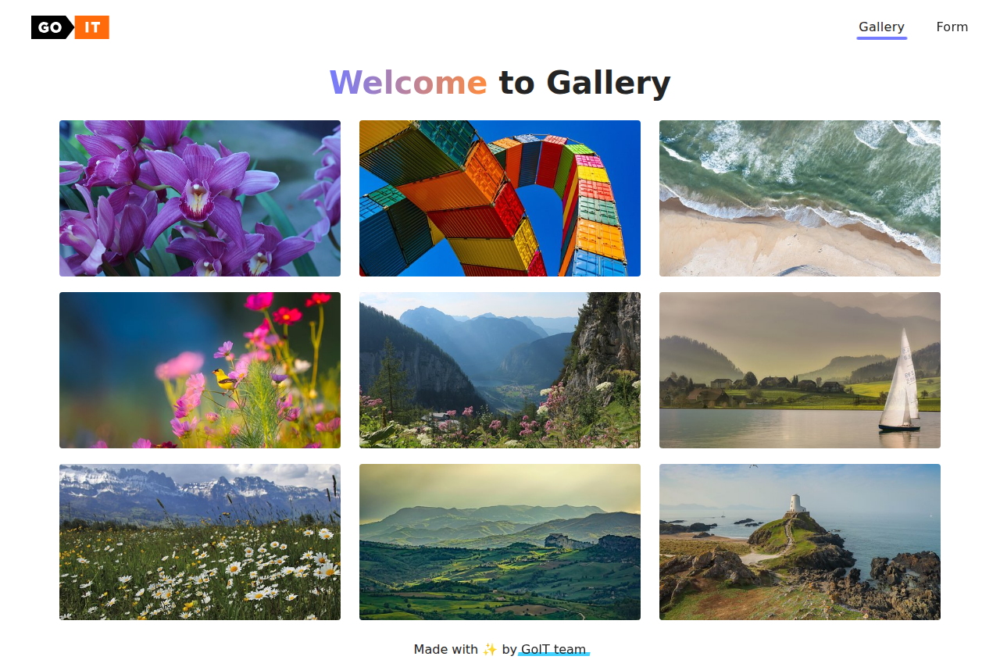

### 🌐 Sprache wählen:

[🇺🇦 Українська](README.md) | [🇬🇧 English](README.en.md) |
[🇩🇪 Deutsch](README.de.md)

# GoIT JS HW-09 — Galerie und Feedback-Formular

<!-- AUTOGEN:STATS -->
[](https://developer.mozilla.org/en-US/docs/Web/HTML) [](https://developer.mozilla.org/en-US/docs/Web/JavaScript) [](https://developer.mozilla.org/en-US/docs/Web/CSS) [](https://support.apple.com/guide/terminal/welcome/mac) [](https://code.visualstudio.com/) [](https://github.com/) [](https://www.figma.com/) 

[](https://github.com/VuToV-Mykola/project-new-generation-25/graphs/traffic)
[](https://github.com/VuToV-Mykola/project-new-generation-25/actions/workflows/screenshot-and-visitor.yaml)
[](https://github.com/VuToV-Mykola/project-new-generation-25)
[](https://github.com/VuToV-Mykola/project-new-generation-25/blob/main/LICENSE)

## 📸 Projekt-Screenshot

<!-- END:AUTOGEN -->

## 🎯 Über das Projekt

Hausaufgabe Nr. 9 für JavaScript. Implementiert:
- dynamische Galerie mit `SimpleLightbox`;
- Feedback-Formular mit `localStorage` und Throttling.

## 🧩 Funktionen

- Galerie-Markup aus einem Bild-Array gerendert.
- Lightbox mit Beschriftungen, Verzögerung und Navigation.
- Formularzustand wird während der Eingabe gespeichert.
- Werte werden nach Reload wiederhergestellt.
- Validierung vor dem Absenden.

## 🛠 Tech-Stack

- HTML5
- CSS3
- JavaScript (ES2025)
- Vite
- SimpleLightbox
- lodash.throttle

## 🔌 SimpleLightbox einbinden

1. Abhängigkeit installieren:
```bash
npm install simplelightbox
```

2. Bibliothek und Styles importieren:
```js
import SimpleLightbox from 'simplelightbox';
import 'simplelightbox/dist/simple-lightbox.min.css';
```

3. Lightbox für Galerie-Links initialisieren:
```js
new SimpleLightbox('.gallery a', {
  captionsData: 'alt',
  captionDelay: 250,
});
```

## 🔌 lodash.throttle einbinden

1. Abhängigkeit installieren:
```bash
npm install lodash.throttle
```

2. Funktion importieren:
```js
import throttle from 'lodash.throttle';
```

3. Für das Speichern des Formularzustands verwenden:
```js
const persistFormState = throttle(() => {
  localStorage.setItem('feedback-form-state', JSON.stringify(formData));
}, 500);
```

## 📁 Struktur

```
goit-js-hw-09/
├── src/
│   ├── 1-gallery.html
│   ├── 2-form.html
│   ├── css/
│   │   ├── gallery.css
│   │   ├── form.css
│   │   └── styles.css
│   └── js/
│       ├── 1-gallery.js
│       └── 2-form.js
├── package.json
└── README.de.md
```

## 🚀 Start

1. Abhängigkeiten installieren:
```bash
npm install
```

2. Dev-Server starten:
```bash
npm run dev
```

3. Seiten öffnen:
- `http://localhost:5173/1-gallery.html`
- `http://localhost:5173/2-form.html`

## ✅ Validierung

- HTML: https://validator.w3.org/
- CSS: https://jigsaw.w3.org/css-validator/
- JS: https://jshint.com/

## 🔗 Links

- [Aufgabe](https://www.edu.goit.global/ru/learn/35708569/18936918/20332333/homework)
- [Figma-Layout](https://www.figma.com/file/m8k9NQV7qZrtYDCvxfD68B/ДЗ-JavaScript?type=design&node-id=3-969&mode=design)
- [Stylelint Rules](https://stylelint.io/user-guide/rules)
- [Code Guide](https://codeguide.co/)

## 📐 Technische Aufgabe

### Завдання 1 - Галерея зображень

Виконуй це завдання у файлах `1-gallery.html` і `1-gallery.js`.
У попередньому домашньому завданні ти самостійно створив/-ла галерею зображень, використовуючи делегування подій, і додав/-ла через CDN бібліотеку модальне вікно для відображення повнорозмірної версії зображення.

Створення галерей — це повсякденна задача розробника, але писати їх вручну кожного разу занадто трудомістко. Для цього існують бібліотеки, які реалізують усю логіку роботи галереї.

Зроби таку саму галерею, але використовуючи бібліотеку SimpleLightbox, яка повністю візьме на себе обробку кліків по зображеннях, відкриття і закриття модального вікна, а також гортання зображень за допомогою клавіатури.

Подивися демовідео роботи галереї.

Зверни увагу на такі деталі:
- Тобі більше не потрібно вручну встановлювати делегування подій, оскільки бібліотека SimpleLightbox автоматично відстежує кліки по картках галереї.
- Окрема бібліотека BasicLightbox для створення модальних вікон більше не потрібна, оскільки функціонал відкриття модального вікна вбудовано в бібліотеку SimpleLightbox.
- Для встановлення бібліотек тепер не потрібно додавати CDN-посилання в `index.html`. Замість цього ми встановлюємо бібліотеки через npm в терміналі.

Виконуй це завдання у файлах `1-gallery.html` і `1-gallery.js`. Розбий його на декілька підзавдань:

- Використовуй код з минулого домашнього завдання та виконай його рефакторинг. Не потрібно писати все з нуля. Наприклад, створення елементів галереї буде таким самим, а код делегування та відкриття модального вікна потрібно видалити.
- Необхідно трохи змінити розмітку картки галереї, використовуй цей шаблон.

```html
<li class="gallery-item">
  <a class="gallery-link" href="large-image.jpg">
    
  </a>
</li>
```

Додай бібліотеку SimpleLightbox як залежність проєкту, використовуючи npm.
Для того щоб підключити CSS код бібліотеки в проєкт, необхідно додати ще один імпорт, крім того, що описаний у документації.

```js
// Описаний в документації
import SimpleLightbox from 'simplelightbox';
// Додатковий імпорт стилів
import 'simplelightbox/dist/simple-lightbox.min.css';
```

Наступний крок — ініціалізація бібліотеки після створення і додання елементів галереї у `ul.gallery`. Для цього ознайомся з документацією SimpleLightbox — насамперед секції «Usage» і «Markup».

Після цього подивись у документації секцію «Options» і додай відображення підписів до зображень з атрибута `alt`. Нехай підпис буде знизу і з'являється через 250 мілісекунд після відкриття модального вікна.

На що буде звертати увагу ментор при перевірці:
- На живій сторінці відображається галерея зображень із масиву даних `images`
- Галерея зображень стилізована згідно з макетом
- Дані для галереї створені динамічно в JS
- Відсутні власні слухачі
- Підключена бібліотека SimpleLightbox з використанням npm
- Екземпляр бібліотеки ініціалізований після додавання елементів галереї у DOM і поза межами будь-яких функцій
- При кліку по елементу галереї відкривається модальне вікно підключеної бібліотеки, в якому міститься збільшена версія зображення
- Через 250 мілісекунд після відкривання модального вікна вміст атрибута `alt` з’являється знизу, як підпис до зображення

### Завдання 2 - Форма зворотного зв'язку

Виконуй це завдання у файлах `2-form.html` і `2-form.js`.
Додай у HTML розмітку форми. У JS напиши скрипт, який буде зберігати значення полів у локальне сховище, коли користувач щось друкує.

```html
<form class="feedback-form" autocomplete="off">
  <label>
    Email
    <input type="email" name="email" autofocus />
  </label>
  <label>
    Message
    <textarea name="message" rows="8"></textarea>
  </label>
  <button type="submit">Submit</button>
</form>
```

Виконуй це завдання у файлах `2-form.html` і `2-form.js`. Розбий його на декілька підзавдань:
- Оголоси поза будь-якими функціями об’єкт `formData` з полями `email` та `message`, які спочатку мають порожні рядки як значення: `{ email: "", message: "" }`.
- Використовуй метод делегування для відстеження змін у формі через подію `input`. Зберігай актуальні дані з полів `email` та `message` у `formData` та записуй цей об’єкт у локальне сховище. Використовуй ключ `"feedback-form-state"` для зберігання даних у сховищі.
- При завантаженні сторінки перевір, чи є дані у локальному сховищі. Якщо так, використовуй їх для заповнення форми та об'єкта `formData`. Якщо ні, залиш поля форми порожніми.
- Перед відправленням форми переконайся, що обидва поля форми заповнені. Якщо будь-яке з полів (властивостей об’єкта `formData`) порожнє, показуй сповіщення з текстом `Fill please all fields`. Якщо всі поля заповнені, виведи у консоль об’єкт `formData` з актуальними значеннями, очисти локальне сховище, об’єкт `formData` і поля форми.

На що буде звертати увагу ментор при перевірці:
- На живій сторінці відображається форма з двома елементами форми і кнопкою типу submit
- Форма стилізована згідно з макетом
- На формі прослуховуються події `input` і `submit`
- При введенні даних у будь-який елемент форми вони записуються у локальне сховище під ключем `"feedback-form-state"`, збережені дані не містять пробіли по краях
- Введення даних в одне поле форми не видаляє дані в сховищі для іншого
- При оновленні сторінки дані з локального сховища підставляються в елементи форми, у полях форми відсутні `undefined`
- При сабміті форми є перевірка, щоб обидва елементи форми були заповнені
- Під час сабміту форми, якщо обидва елементи форми заповнені, виводиться у консоль об'єкт з полями `email`, `message` та їхніми поточними значеннями, а також очищаються сховище і поля форми
- Якщо після сабміту форми ввести в будь-який елемент форми дані, то в локальному сховищі не з’являються дані від попереднього сабміта
